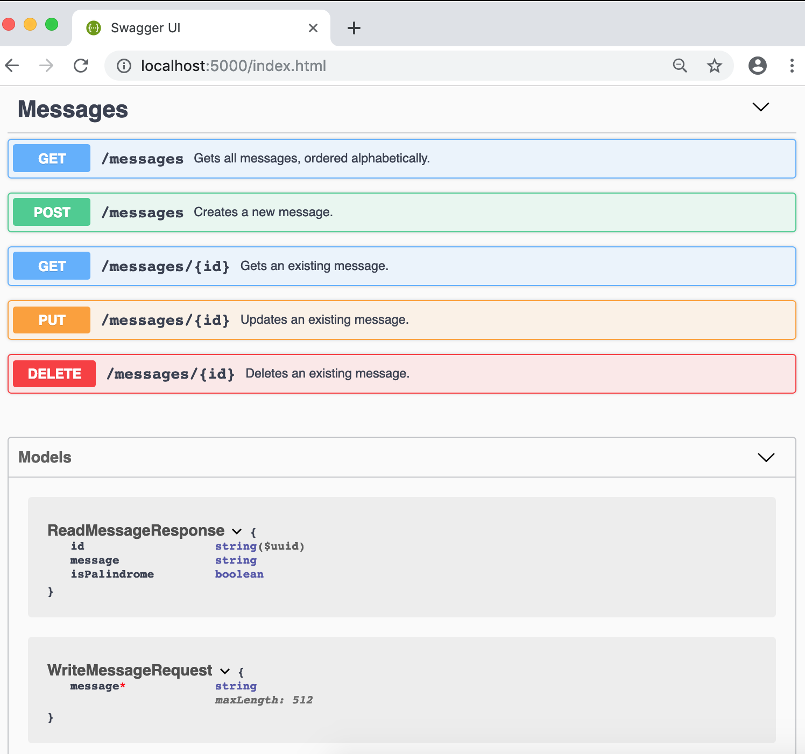

# Messages REST API
This a sample project which manages messages and provides details about those messages, specifically whether or not a message is a palindrome. It supports the following operations: create, retrieve, update, and delete a single message, as well as listing all messages.

## Run API:
You can build and run the project locally using the following command (assuming that you are in the root folder of the repository)

```console
docker-compose build && docker-compose up
```

> **Note**: The [Docker Compose file](docker-compose.yml) maps port 5000 on your machine to port 8080 in the container. If that port is already in use, you will see an error and have to choose a
different port.

After the application starts, you should be able to navigate to `http://localhost:5000` in your web browser and invoke the API via cURL.

```console
curl -X GET "http://localhost:5000/api/messages" --verbose --include
```

## Run unit tests:
To execute the unit tests locally, run the following commands from the root folder.

```console
dotnet test --logger 'console;verbosity=detailed'
```

You should see an output similar to this in the console.

```console
√ Messages.Tests.Controllers.MessagesControllerTests.Update_UnknownMessage_ReturnsNotFound [9ms]
√ Messages.Tests.Controllers.MessagesControllerTests.Update_MessageToBeAPalindrome_ReturnsNoContentAndPalindromePropertyIsTrue [11ms]
√ Messages.Tests.Controllers.MessagesControllerTests.Delete_ExistingMessage_ReturnsNoContent [17ms]
√ Messages.Tests.Controllers.MessagesControllerTests.Add_PalindromeMessage_ReturnsCreatedAndPalindromePropertyIsTrue [5ms]
√ Messages.Tests.Controllers.MessagesControllerTests.Get_MessagesWithUnknownSearchTerm_ReturnsNoItems [9ms]

Test Run Successful.
Total tests: 102
     Passed: 102
Total time: 1.7048 Seconds
```
--------------

## Documentation
This project uses [Swagger](https://swagger.io/) to generate the API docs, and the Swagger UI is available at the root of the web application. All operations are listed, along with their descriptions, status codes, and required parameters (if any).


